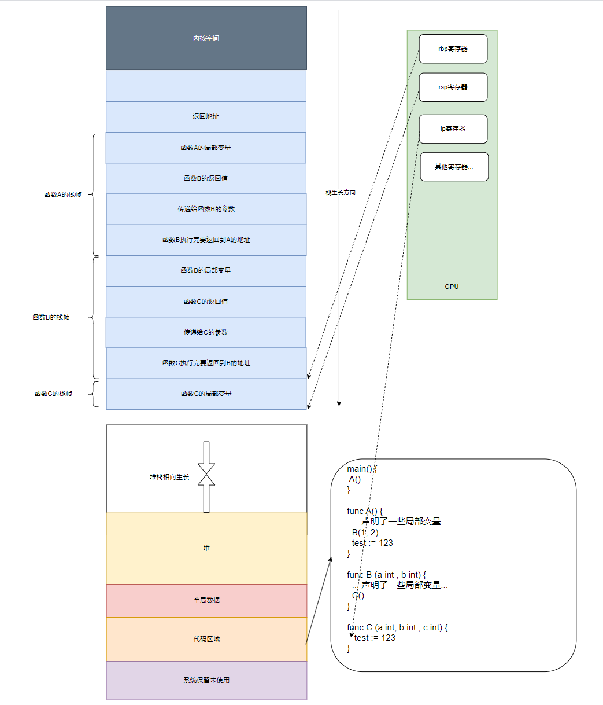

# 重要

Go 的内存分配由编译器逃逸分析决定：不逃逸 → 栈上分配（函数返回即释放），逃逸 → 堆上分配（GC 回收）。`make` 和 `new` 只是分配方式的不同，本质区别在于它们创建和初始化的对象不同。

## 1. new vs make

| | `new(T)` | `make(T, ...)` |
|------|----------|----------------|
| 适用类型 | 任意类型 | 仅 slice / map / chan |
| 返回值 | `*T` 指针 | T 值（非指针） |
| 初始化 | 置零，不初始化内部结构 | 分配并初始化内部数据结构 |
| 使用频率 | 低（通常被复合字面量替代） | 高 |

```go
p := new(int)        // *int, 指向 0
s := make([]int, 5) // []int, len=5, cap=5, 底层数组已分配
```

`new([]int)` 返回的 `*[]int` 指向 nil 切片（底层数组未分配），必须再用 `make` 初始化——所以 `new` 对 slice/map/chan 几乎无用。

## 2. 栈与堆分配规则

编译时分析变量**生命周期**，决定分配位置：

| 条件 | 分配位置 |
|------|----------|
| 局部变量、未逃逸、大小不大 | **栈** |
| 返回指针 | **堆**（触发逃逸） |
| 闭包捕获 | **堆** |
| 接口类型赋值 | 可能逃逸到**堆** |
| 对象 > 64KB | **堆** |

```go
x := 42          // int      - 栈上
y := 3.14        // float64  - 栈上
r := x + y       //          - 栈上
s := "temp"       // string   - 可能栈上（header 在栈，底层字节在只读区）
```

堆上分配：

```go
func escape() *int {
    x := 42
    return &x  // x 逃逸到堆上
}
```

### 2.1 栈帧示意



函数调用时，每个 goroutine 的栈从 2KB 开始动态扩展。栈上变量按函数帧组织，函数返回时整帧回收——无需 GC 介入。

## 3. 逃逸分析

Go 编译器对 `struct` 也可以做逃逸分析，将短生命周期对象分配在栈上。这不同于 Java 等语言中 new 出来的对象都在堆上。

逃逸分析的触发条件：

| 条件 | 说明 |
|------|------|
| 返回指针 | 一定逃逸 |
| 跨函数传递指针 | 可能逃逸 |
| 闭包捕获变量 | 逃逸 |
| 接口赋值 | 值类型装箱 → 可能逃逸 |
| 对象过大（>64KB） | 直接堆分配 |
| 编译器无法追踪 | 保守策略——堆分配 |

查看逃逸分析结果：

```bash
go build -gcflags="-m" main.go
```

## 4. 为什么逃逸分析对 GC 很重要

Go 的逃逸分析是 GC 设计取舍的基石：

1. **短生命周期对象在栈上** → 函数返回即释放，不增加 GC 压力
2. **堆上新生代对象少** → 分代 GC 收益不大（新生代回收收益来自"大部分对象短命"的假说，而 Go 中这些对象根本不在堆上）
3. **因此 Go 选择标记-清除而非分代法**

这与 Java 等语言的设计路线不同——Go 把 GC 压力转嫁给了编译期的静态分析。

## 5. 总结

1. `make` 创建并初始化 slice/map/chan，`new` 只分配零值指针，几乎被复合字面量替代；
2. 不逃逸 → 栈 → 函数返回即释放；逃逸 → 堆 → GC 回收；
3. 逃逸分析是 Go GC 不采用分代法的核心原因——堆上新生代对象数量有限。

## 6. 参考

- [Go 逃逸分析](https://dave.cheney.net/high-performance-go-workshop/dotgo-paris.html#escape_analysis)
- [Go 内存分配器](https://draveness.me/golang/docs/part3-runtime/ch07-memory/golang-memory-allocator/)
