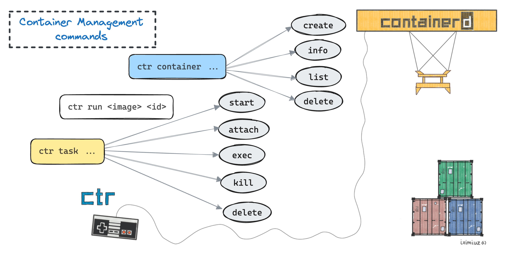

## 背景
Kubernetes 在 v1.24 版移除dockershim。移除后，将不能直接使用`Docker Engine`作为容器运行时(如需使用，要额外安装cri-dockerd)。本文探讨的docker，实际上是指Dockershim。

CRI: 容器运行时接口(Container Runtime Interface), K8S-1.5版本(2016年底)引入的接口标准，增加对容器运行时的可扩展性；


快问快答：
- dockershim是什么?       dockershim是一个临时解决方案，用来解决`Docker Engine`与K8S的兼容性。
- 为什么移除dockershim?   它的存在拉长了调用链。同时也为Kubernetes维护者增加了沉重的负担。
- K8S-1.24+版本还能否使用DockerEngine? 需要额外安装对应的运行时cri-dockerd

启用docker-shim的常见问题：
- docker镜像能正常工作么?  可以。docker build 创建的镜像适用于任何 CRI 实现。现有的镜像和往常一样工作，没有任何影响。
- 能否正常拉取私有仓库的镜像？可以。所有 CRI 运行时均支持 K8S 中相同的拉取（pull）Secret 配置，不管是通过 PodSpec 还是通过 ServiceAccount 均可。
- 当切换 CRI 底层实现时，应该注意什么？
  - 日志配置
  - 运行时的资源限制
  - dind或者访问docker的sock文件，比如，构建镜像操作时。
  - kubectl插件，如果需要访问docker
  - 类似kube-imagepuller工具，需要之间访问Docker
  - k8s节点上，registry的相关配置。例如，mirrors、仓库自签证书受信等
  - 监控、安全agent，在k8s集群外使用dockerEngine运行的相关脚本或守护进程
  - GPU等特殊硬件，取决于其与运行时、Kubernetes的集成实现

## containerd相关工具介绍


ctr：containerd 的一个客户端工具。

crictl：是 CRI 兼容的容器运行时命令行接口，可以使用它来检查和调试 k8s 节点上的容器运行时和应用程序，需要额外安装。

netdctl: nerdctl，使用效果与docker命令的语法一致, 还实现了很多 docker 不具备的功能，例如延迟拉取镜像（lazy-pulling）、镜像加密（imgcrypt）等。

### 客户端配置

- crictl

执行以下命令：
```bash
crictl config runtime-endpoint unix:///run/containerd/containerd.sock
crictl config image-endpoint unix:///run/containerd/containerd.sock
```
命令执行后，将会修改配置文件`/etc/crictl.yaml`，配置如下：
```yaml
runtime-endpoint: unix:///run/containerd/containerd.sock
image-endpoint: unix:///run/containerd/containerd.sock
timeout: 10
debug: false
```

- ctr

默认sock文件地址为`unix:///run/containerd/containerd.sock`, 如果默认地址无效，通过以下方式设置

一种，参数指定sock地址，并使用alias
```bash
alias ctr='ctr --address /run/k3s/containerd/containerd.sock'
```

另一种，设置软链接至默认位置
```bash
ln -s /run/k3s/containerd/containerd.sock /run/containerd/containerd.sock
```


### ctr命令介绍



等价 `docker run nginx` 命令的ctr命令

> 注意：`docker run`命令可以缺省容器名称，但`ctr run`必须指定容器名称
> docker `--restart=always`等操作无法用`ctr run`实现，而`ctr run`也有docker所不具备的功能。

```bash 
ctr image pull docker.io/library/nginx:latest
ctr run docker.io/library/nginx:latest nginx
```

`ctr run`是一个组合命令：`ctr container create` 和`ctr task start`的组合。

```bash
ctr container create docker.io/library/nginx:alpine nginx

# --detach 后台运行，nginx为容器ID
ctr task start --detach nginx
```

#### 容器container与任务task

container：容器是进程的隔离和受限的执行环境。
task：任务代表容器内运行的实际进程。


### 镜像管理


### 容器管理

### 对比

| 命令                     | docker                       | ctr（containerd）                           | crictl（kubernetes） | 常用程度 |
| ------------------------ | ---------------------------- | ------------------------------------------- | -------------------- | -------- |
| **操作镜像**             |                              |                                             |                      |          |
| 构建镜像                 | docker build -t <path:tag> . | 无                                          | 无                   | ★★★★★    |
| 查看镜像                 | docker images                | ctr image ls                                | crictl images        | ★★★★☆    |
| 拉取镜像                 | docker pull                  | ctr image pull                              | ctictl pull          | ★★★★★    |
| 推送镜像                 | docker push                  | ctr image push                              | 无                   | ★★★☆     |
| 打标签                   | docker tag                   | ctr image tag                               | 无                   | ★★★☆     |
| 导出镜像                 | docker save                  | ctr image export <文件名称> <image-path>    | 无                   | ★★★☆     |
| 导入镜像                 | docker load                  | ctr image import <OCI-TAR-archive, img.tar> | 无                   | ★★★☆     |
| 删除镜像                 | docker rmi                   | ctr image rm                                | crictl rmi           | ★★★☆     |
| **操作容器**             |                              |                                             |                      |          |
| 查看容器列表             | docker ps                    | ctr task ls/ctr container ls                | crictl ps            | ★★★★★    |
| 查看容器数据信息         | docker inspect               | ctr container info                          | crictl inspect       | ★★★★★    |
| 创建一个新的容器         | docker create                | ctr container create                        | crictl create        | ★★★★☆    |
| 运行一个新的容器         | docker run                   | ctr run                                     | 无（最小单元为pod）  | ★★★★☆    |
| 启动/关闭已有的容器      | docker start/stop            | ctr task start/kill                         | crictl start/stop    | ★★★★☆    |
| 删除容器                 | docker rm                    | ctr container rm                            | crictl rm            | ★★★★☆    |
| 查看容器日志             | docker logs                  | 无                                          | crictl logs          | ★★★★★    |
| 查看容器资源             | docker stats                 | 无                                          | crictl stats         | ★★★★☆    |
| 登录或在容器内部执行命令 | docker exec                  | 无                                          | crictl exec          | ★★★★★    |
| 清空不用的容器           | docker image prune           | 无                                          | crictl rmi --prune   | ★★★★★    |
| **操作Pod**              |                              |                                             |                      |          |
| Pod列表                  | 无                           | 无                                          | crictl pods          | ★★       |
| Pod详情                  | 无                           | 无                                          | crictl inspectp      | ★★       |
| 启动Pod                  | 无                           | 无                                          | crictl runp          | ★★       |
| 停止Pod                  | 无                           | 无                                          | crictl stopp         | ★★       |

> 镜像编译，推送仓库：docker、nertdctl
> K8S节点上，镜像的拉取、导入导出：ctr
> K8S节点上，调试容器，查看日志，容器状态：crictl

运行容器：
> -d  detach，后台
> -t  tty，添加一个伪终端

```bash
ctr -n k8s.io run -d -t --env TEST_PORT=8080 
```

## 结论
cdebug 作为一款专为容器环境设计的调试工具，它通过提供一系列高级功能，极大地简化了容器化应用的调试流程。无论是面对无 Shell 容器、需要端口转发的场景，还是需要导出文件系统，cdebug 都能提供有效的解决方案，是云原生开发者的得力助手。

## 参考

[cdebug github](https://github.com/iximiuz/cdebug)