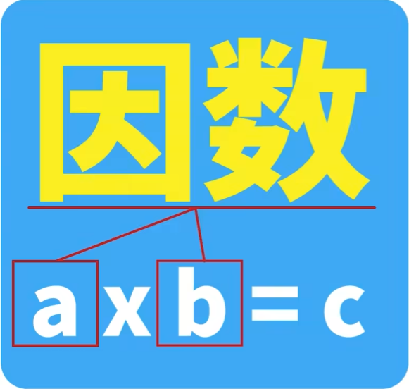
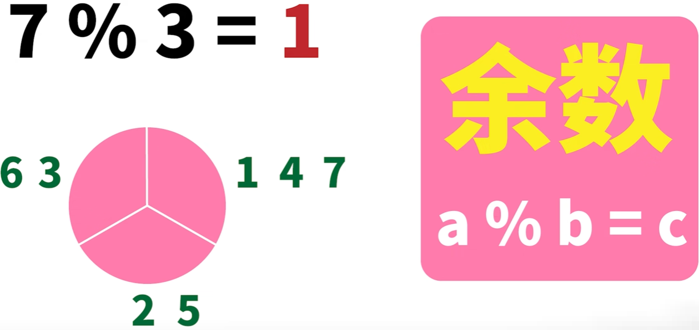
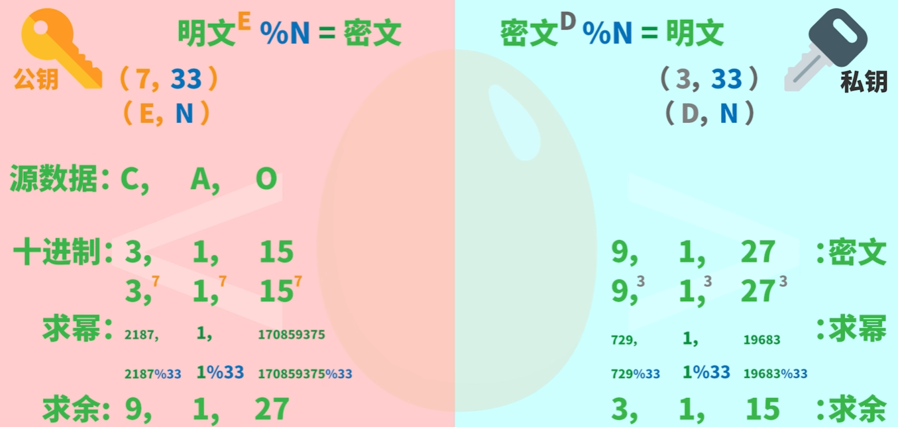
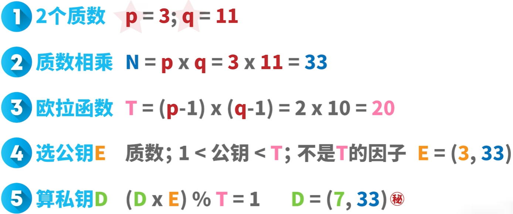

> 经典算法**分解质因数**是指数复杂度，所以rsa算法难以破解。即两个大质数相乘很容易算，但是想把乘积分解成两个大素数就很难。

## 数论

### 因数、质数、余数

- 因数
两个数字相乘得到第三个数字，这两个相乘的数字就被称为第三个数字的一组因数。例如数字6有两组因数(1,6)和(2,3)


- 质数(素数)
只有一组因数的数字就是质数（即只能由1和它本身相乘获得）

- 余数



### 欧拉定理
> 欧拉定理是一个关于同余的性质。可以简化幂的模运算(模运算就是求余， 比如计算7+10^n次方的个位数，就等同于7+10^n次方对10求余，等同与7对10求余)

如果两个正整数a与n互质，则a的φ(n)次方对n求余的余数为1（a的φ(n)次方减1，可以被n整除）。
- φ(n)被称为欧拉函数，是计算任意正整数n，在[1,n]范围内，有多少与n互质，用于计算这个值的方法被称为欧拉函数。

若n是一个质数，且a不是n的倍数，则a^（n-1）=1（mod n），这个定理保证了rsa算法的可靠性。

## 加密过程

> N=33 公开的，用来求余
> E=7  公开的，用来求幂
> D=3  私有的，用来求幂
> 


N即为密钥长度，通常设置2048，指定的是数字N的位数2048bit，一般电脑破译需要300万亿年

## 生成过程
1. 随机挑选两个质数p、q，这两个质数相乘即得到N(求余因子)，N也是公钥和私钥里出现的那个相同的数字，
2. 需要用到欧拉函数T，此处不展开欧拉函数的推导过程。只用关注使用p-1与q-1相乘获得T（欧拉函数T的含义是在[1,N]的范围中，存在T个数与N互质）
4. 重点步骤：选公钥E。选公钥E的条件：[公钥E必须是质数 && 1<公钥E<T && E不能是T的因子]，满足这三个条件会有一些数字[3 5 7 11 13 17 19], 在这些数字中挑选一个数字作为公钥E [E,N]
5. 计算出私钥D。计算私钥的公式：D和E相乘再除以T得到的余数必须为1。这样可以计算出D，私钥 [D,N]

公钥于私钥是成对的，这个算法重要的是不能被人知道或者算出私钥数字D，要计算私钥数字D需要先知道公钥数字E和欧拉函数T，因为公钥数字E包含在公开的公钥中，
因此T是算出私钥数字D的关键数字，要计算T需要p和q两个质数，当这两个质数设置的很大，那么N与T也会非常大，即使公开N，也很难找出这两个质数。



## 可靠性(破解难度)
> N可以被因数分解，D就可以算出，也就意味着私钥被破解。RSA的可靠性是靠**分解质因数**的复杂度保证的。

维基百科这样写道：

"对极大整数做因数分解的难度决定了RSA算法的可靠性。换言之，对一极大整数做因数分解愈困难，RSA算法愈可靠。

假如有人找到一种快速因数分解的算法，那么RSA的可靠性就会极度下降。但找到这样的算法的可能性是非常小的。今天只有短的RSA密钥才可能被暴力破解。到2008年为止，世界上还没有任何可靠的攻击RSA算法的方式。

只要密钥长度足够长，用RSA加密的信息实际上是不能被解破的。"

## 解密正确性
> 公钥数字E 私钥数字D  密钥长度N  两质数p,q  欧拉函数T 
> N = p * q ; (D*E)%T = 1; T = (p-1)*(q-1)
> 
> mod：取模运算符，a mod b=c 标示 a除以b的余数为c, 可以变形为`a = c(mod b)`
> 同余：给定正整数m，如果两个正整数a、b满足a-b可以被m整除，即m|(a-b),那么a对m求余的值是等于b对m的求余的，也被称为a与b对模m同余，是整数的一个等价关系
> ≡ 恒等号，用于恒等号，a、b关于M同余，记作`a≡b(mod m)`,
> gcd 最大公约数：gcd(a, m)=1, a和m的最大公约数为1，这也意味着a与m互质


为什么密文M用私钥D解密，一定可以正确地得到明文C。也就是证明下面这个式子成立：

```
明文 ≡ 密文^D(mod N)
```

由于密文是明文通过此加密公式`明文^E % N ≡ 密文`生成的，即已知`密文 = 明文^E - xn`, 此处x（商）为一正整数。即`密文 ≡ 明文^E(mod n)` 将密文带入须证明的解密公式中，得到：
由证明
```
明文 = 密文^D % N 
```
变为证明
```
明文 = (明文^E - xn)^D % N
```

> (明文^E - xn)^D = 明文^ED + {中间项都是n的倍数} +(xn)^D   因此 (明文^E - xn)^D ≡ 明文^ED


```
明文^ED % N ≡ 明文
```

由私钥数字D得计算公式`(D*E)%T = 1`变形可得 `D*E = 1mod(T) ` 可令 `D*E = k*T + 1 ` 此处k（商）为一正整数, 带入上面公式

```
明文^(k*T + 1) ≡ 明文(mod n)
```

分两种情况证明上面公式：

- 


# 1.简介

# Reference

[RSA算法原理（一）](https://www.ruanyifeng.com/blog/2013/06/rsa_algorithm_part_one.html)
[RSA算法原理（二）](https://www.ruanyifeng.com/blog/2013/07/rsa_algorithm_part_two.html)
