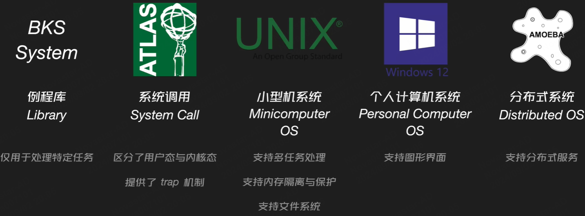
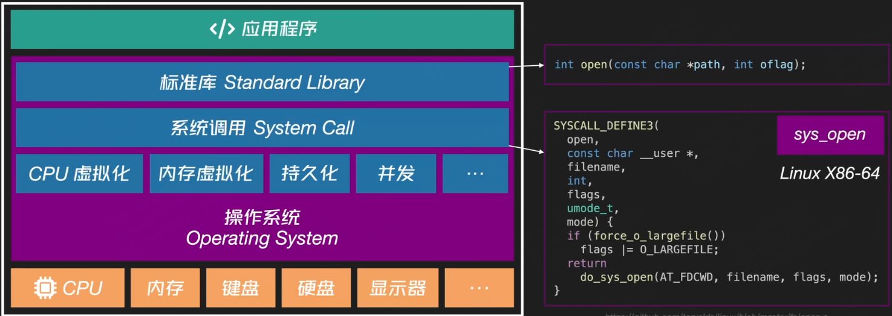

以威斯康星大学麦迪逊分校的开源书籍《Operating Systems: The Easy Pieces》的内容为主线，系统学习组成操作系统的各种关键概念。

## 文章目录

- 构建
    - 虚拟化`Virtualization`
    - 并发`concurrency`
    - 持久化`persistence`

## 问题

- 操作系统如何工作的？
  - OS如何决定哪个程序使用CPU？
  - OS如何将资源虚拟机化？
  - 如何在虚拟内存系统中处理内存使用过载？
  - 虚拟机监控器如何工作？
  - OS如何管理磁盘上的数据？
  - 如何构建分布式系统？

## 发展简史



BKS System: 仅由一些用于处理特定任务的**常用例程(例程库)**组成，计算机同一时间只能执行一个程序，程序由专门操作员控制，而这些常用例程可以方便开发者操作底层IO设备等计算机硬件。

ATLAS计算机：系统调用概念最先出现在ATLAS计算机系统中，系统调用与例程类似，到系统调用会伴随着**从用户态到内核态的执行环境转移过程**。默认用户代码在具有较低权限的用户态执行，而系统调用代码则在具有较高权限的内核态执行，用户代码通过`trap`指令调用Sys-call并进入内核态，当系统调用执行完毕后，通过`return-from-trap`指令将执行环境重新返回用户态。使得用户代码无法触及内核态以及底层硬件。

UNIX小型机系统：**OS具备了多任务处理能力、内存隔离与保护、相对完备的文件系统**

个人计算机系统：图形界面，在小型机的基础上，又增加了更多人机交互能力

分布式操作系统：分布式服务


## 术语

PCH: 

TU: 

IR: 

AST: 


## 程序运行的本质？
应用程序对应的**机器代码**会被加载到计算机内存，以备后用。CPU的任务可被归纳为三个阶段：
取指Fetch(IF)：CPU从内存中`取出`下一个需要执行的**机器指令**；
译码Decode(ID)：CPU会对**机器指令**进行`解码`，并转换为相应的**控制信号**；
执行Execution(EX)：CPU将这些**控制信号**发送给不同的**内部处理单元**，并控制它们完成指令对应的**任务**。


> 除核心计算资源CPU外，还有内存、硬盘、键鼠、显示器等硬件设备，操作系统则是软件部分的核心，它让程序可以**更方便的与底层硬件交互**，而不再需要单独与各类芯片上的IO端口直接通信。

操作系统的组成

- 标准库：位于OS组成中的最上层，提供了覆盖各类功能的众多**可移植编程接口**，这些接口通常拥有统一的调用方式，在不同的语言中使用。

- 系统调用：位于标准库下方，OS通过系统调用的形式，将**计算机的基础能力进行了抽象**，它们是APP与OS进行的最直接交互。

- 重要机制：位于系统调用下方，OS内部的一些重要**机制**，`CPU虚拟化`、`内存虚拟化`、`持久化`、`并发`等等。这些机制决定了上层App的实际运行模型。也是OS的重点。



以打开文件举例：

标准库：对应的是Open函数(C-POSIX标准库中提供的接口)，用于打开制定路径下的文件。

> 针对标准库接口的内部实现中，针对文件的实际打开操作，是由相应的**系统调用**完成的

系统调用：上图是针对Linux X86-64平台，Linux OS源码中定义sys_open系统调用的代码

> sys-call在os层面定义了“文件打开”操作的具体行为，而通过将它封装为sys-call，上层应用可以以黑盒的形式，友好的使用系统能力。

标准库、应用程序如何调用sys-call？

`App\std-lib`并不是以函数调用的形式使用`sys-call`，`sys-call`会被统一注册到相应的系统注册表, `app\std-lib`以偏移量指定注册表中的单元格，从而调用单元格对应的`sys-call`代码。

例如X86-64体系上，通过以下汇编指令来调用sys_open这个系统调用
> 数字2表示：使用系统调用表中，第三个单元格对应的系统调用，即sys_open
```
mov rax, 2
```

## 内部机制

### CPU虚拟化

目标：每个进程由独立的cpu进行处理，任何一个进程的运行状态都不会影响到其他进程。

机制：分时控制

概念：进程

### 内存虚拟化

目标：每个进程都享有完全独立的内存资源。

机制: 虚拟地址空间

概念：

### 持久化

目标：将数据长时间的保留在计算机上。

机制：文件系统（RAID\FFS\LFS\FSCK\Files\Journaling\NFS\AFS\COW..）

### 并发

目标：多线程，利用多核cpu带来的任务并行性

概念：TLS(线程本地变量)、Semaphore(信号量)、ConditionVariable(条件变量)、RaceCondition(竞态条件)、Lock(锁)、Bounded-buffer(生产者-消费者问题)...


## 总结

操作系统位于硬件、应用程序中间。向上，它为应用程序提供了虚拟化的底层资源，让应用程序可以不用考虑计算机在硬件层面的复杂性（os因此被成为虚拟机）；向下，os又提供了针对硬件层面的资源管理（os因此被称为资源管理器）。而Std-lib、Sys-call、内部机制组成了操作系统的内部抽象，简化了上层应用的开发流程。

操作系统还有考虑以下因素：

性能，如何最大程度**减少OS本身的性能损耗**，来保证应用程序的性能最大化

可靠性，OS需要**长时间运行**，需要尽可能保证不会发生意外情况时退出

安全性，OS管理了所有硬件资源，进程间隔离、防范恶意软件

可移动性，支持不同的硬件架构，可部署在移动设备载体


## 参考链接

[操作系统导论（中文版）](https://itanken.github.io/ostep-chinese/)

[口袋操作系统-简介](https://www.bilibili.com/video/BV1JM4m1U71z/?spm_id_from=333.999.0.0&vd_source=332076d22acbab360d02dc344b0e9a17)