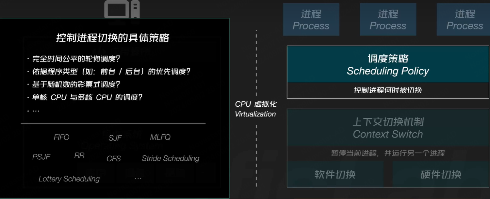
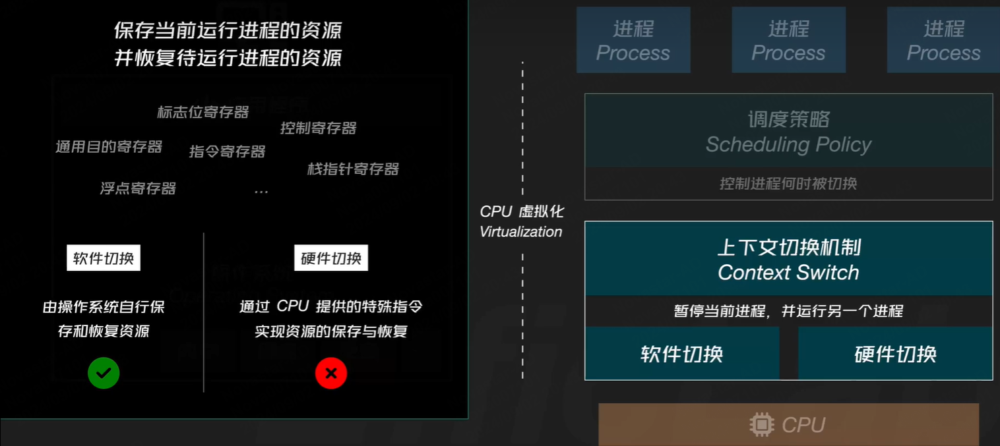
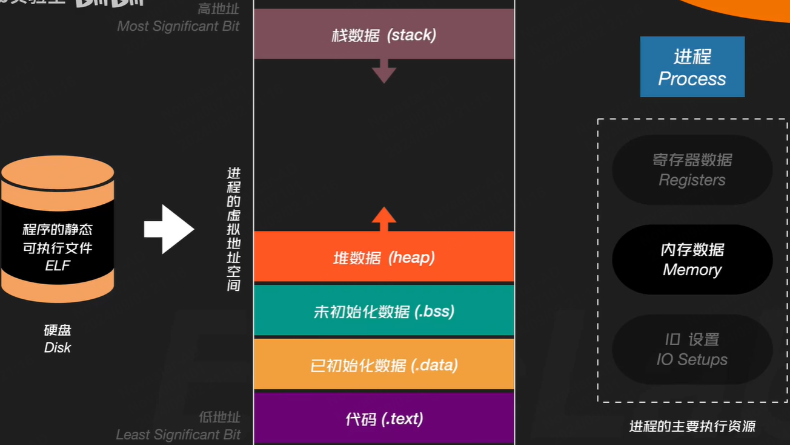
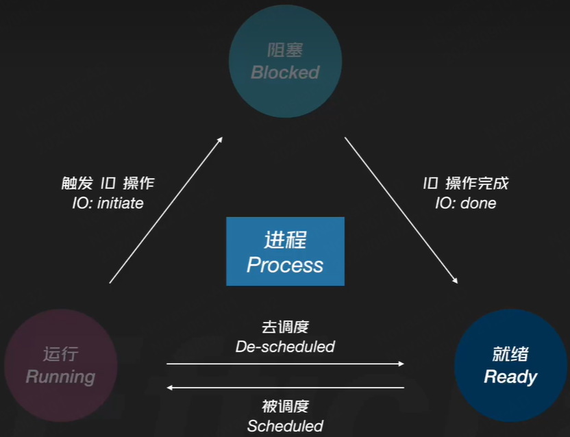
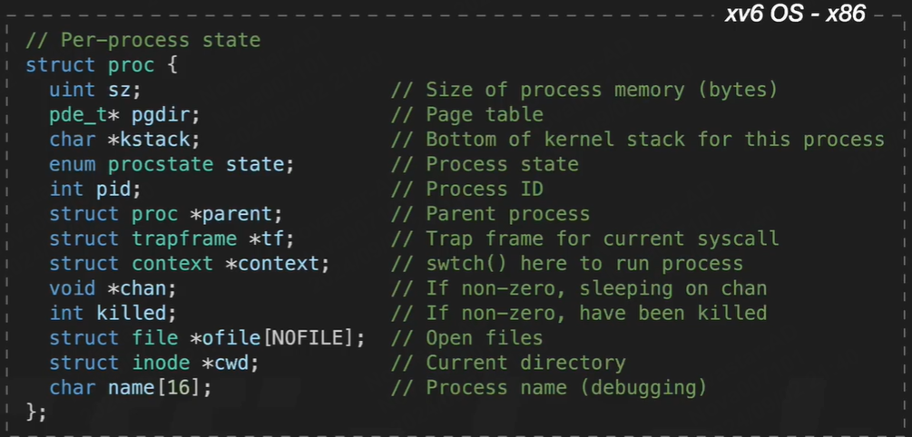

操作系统架起了底层硬件与上层应用程序之间的桥梁。而进程，就是应用程序的运行时抽象。

## 文章目录

- 构建
    - 虚拟化`Virtualization`
    - 并发`concurrency`
    - 持久化`persistence`

## 问题

- 操作系统如何工作的？
  - OS如何决定哪个程序使用CPU？
  - OS如何将资源虚拟机化？
  - 如何在虚拟内存系统中处理内存使用过载？
  - 虚拟机监控器如何工作？
  - OS如何管理磁盘上的数据？
  - 如何构建分布式系统？

## 进程说明

进程是应用程序的运行时表现，操作系统通过`分时控制`机制实现针对进程的CPU虚拟化。

## 分时控制机制

分时控制：将CPU的工作时间分割为若干短小的**时间片**（时间片长度不等），而在每个时间片中，OS都会让CPU执行不同进程所对应的任务。时间片长度不等，cpu在每个时间片内会选择哪个进程也并不一定。当时间片足够短，且CPU在各个进程之间的切换足够快时，则会表现为进程独占cpu,即cpu虚拟化的效果。

**OS通过调度策略决定进程的切换顺序和时机，而切换过程则通过上下文切换来完成。**

### 调度策略
> 控制进程何时被切换，即进程之间的具体切换规则，这个规则实际决定了CPU需要去执行哪个进程的任务、执行多长时间。

调度策略决定了 操作系统采用怎样的方式 来控制进程切换，这个过程需要考虑以下事情：

- 为了保证各个进程 在整体运行时间上的公平性，是否可以采用CPU时间片相等的轮询调度？
- 是否需要考虑不同进程的类型，如前台/后台进程 在调度优先级上是否有区别？
- 完全随机的调度方式是否可取？
- 同一调度策略 是否能够完全兼顾单核CPU与多核CPU呢？

常用调度算法：FIFO\SJF\MLFQ\PSJF\RR\CFS\StrideScheduling\LotteryScheduling

### 上下文切换机制
> 暂停当前进程，并运行另一个进程
> 为了完成上下文切换，需要保存当前运行进程的执行资源，并恢复待运行进程的执行资源。
> 上下文：决定某个进程某一时刻运行状态的所有相关数据。
> 进程资源：各类相关寄存器中所保存的数据

实现方式：软件切换、硬件切换。

软件切换：需要由操作系统自行依次保存、恢复所有与进程运行相关的数据资源。在这个过程中，操作系统可能需要使用很多条mov指令来存储相关寄存器中的数据。

硬件切换：比如，x86体系中仅通过一条call指令，就可以完成基于任务门的上下文切换过程，指令执行后cpu会自动保存与进程运行相关的重要数据，并将CPU的当前执行任务切换至新进程

现代操作系统大多采用软件切换。

因为硬件切换没有给予操作系统足够的可配置项，为了适应所有的操作系统需求，硬件切换在进行上下文切换时，几乎保存了所有的cpu状态，并进行了最完备的权限检查，使得上下文切换过程变得缓慢。

但实际情况是，大多数操作系统在实现进程上下文切换时，并不需要保存所有的CPU状态，也并不需要繁杂的权限检查。

因此软件切换的灵活性，可以让操作系统自行决定 在进行上下文切换时，所采用的 资源保存 与 恢复策略，从而让整个过程更友好、高效。

## 进程执行资源

除寄存器数据外，进程的主要执行资源 还包括内存数据、与进程相关的IO设置。

应用程序在被真正运行之前，它所对应的静态文件 是以某种可执行文件格式（ELF\Mach-O\COFF..）的形式，被存放在计算机磁盘等本地存储设备中。

当可执行文件被操作系统加载 并准备开始运行时，程序运行所需的数据 都会被加载至其对应**进程的虚拟地址空间**中，

虚拟地址空间：同一计算机，进程的虚拟地址空间大小相同，且覆盖相同的地址段，比如从地址0x0000~0xffff。因此，对应用程序来说，它可以使用整个空间内的所有地址，而不用担心与其他进程产生冲突。**虚拟**是因为这个空间中的内存地址 并非实际的物理内存地址。因此调试程序时打印的绝大多数内存地址，实际都是虚拟内存地址。

虚拟地址空间存放的数据：进程当前运行所需要的数据
地址 由 低  到 高，数据分别划分以下区域：

代码.text段：存放程序代码(ELF格式中，通常也被标记为.text)

已初始化数据：存放程序已初始化数据的.data段

未初始化数据：存放程序未初始化数据的.bss段

堆数据：存放动态数据的heap段，动态数据也即我们常说的**堆数据**，随程序运行不断申请空间，堆空间向高地址动态增长。

栈数据：虚拟地址空间的高地址某处，存放程序的执行**栈数据**，一般为函数调用时产生的本地变量值、参数值、函数返回地址等等。随着函数调用的层级逐渐深入，栈空间大小会向低地址逐渐增长

### IO设置

默认情况下，进程可以直接与标准输入、标准输出、标准错误三种IO流交互。操作系统在执行程序代码前，就为进程设置好这三种默认IO流，并使其为可用状态。因此IO设置也是进程的主要执行资源。

1. 进程执行资源准备完毕
2. OS开始基于调度策略安排进程运行

进程最基本的状态转移模型：

Ready就绪：进程还没有被分配CPU时间片，因此还没有运行

> 随着进程被调度，进程被赋予相应的cpu时间片，并开始运行

Running运行：进程处于运行状态

> 进程运行某一时刻，进程执行了一些**同步IO操作**，比如，读取文件。同步意味着在读取文件这个IO操作完成前，进程后续代码都无法被执行，为了更换利用CPU，操作系统通常会将这类进程暂时置为阻塞状态。

Blocked阻塞：处于阻塞状态的进程 无法被直接运行。

> 直到进程执行的IO操作结束，操作系统再次将进程状态置为Ready，并在合适的时机，为其分配CPU时间片。

处于运行状态的进程也不会一直运行，当手上的CPU时间片使用完毕后，进程会被置为就绪状态，等待操作系统的下一次调度。

初始Initial: 默认OS会将这类进程快速转换为Ready状态，某些实时操作系统中，这个动作会延时发生。

僵死Zombie: 表示进程已退出，但还未被操作系统进行资源回收

### 进程实现细节
> 以xv6操作系统的代码为例

与进程相关的信息大部分会被整理在PCB(Process Control Block)进程控制块的结构中。

PCB为结构体，包含进程ID、状态、名称、已打开文件等信息

操作系统中，同时运行的所有进程，被维护在进程列表中

进程表也为结构体，ptable字段以数组的形式，保存了所有进程对应的PCB结构

与进程相关的操作（fork、scheduler进程调度器、wakeup唤醒进程、wait等待子进程退出、exit使进程退出、sleep使进程进入阻塞状态）则都会围绕进程列表、进程的PCB结构展开交互。

## 总结

操作系统位于硬件、应用程序中间。向上，它为应用程序提供了虚拟化的底层资源，让应用程序可以不用考虑计算机在硬件层面的复杂性（os因此被成为虚拟机）；向下，os又提供了针对硬件层面的资源管理（os因此被称为资源管理器）。而Std-lib、Sys-call、内部机制组成了操作系统的内部抽象，简化了上层应用的开发流程。

操作系统还有考虑以下因素：

性能，如何最大程度**减少OS本身的性能损耗**，来保证应用程序的性能最大化

可靠性，OS需要**长时间运行**，需要尽可能保证不会发生意外情况时退出

安全性，OS管理了所有硬件资源，进程间隔离、防范恶意软件

可移动性，支持不同的硬件架构，可部署在移动设备载体

## 参考链接

[操作系统导论（中文版）](https://itanken.github.io/ostep-chinese/)

[口袋操作系统-进程基础](https://www.bilibili.com/video/BV1gi421Y7NP/?spm_id_from=333.999.0.0)